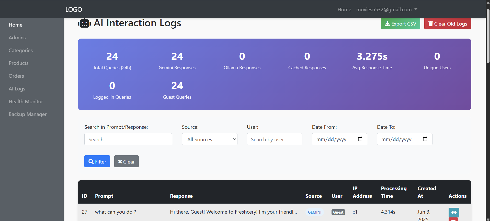
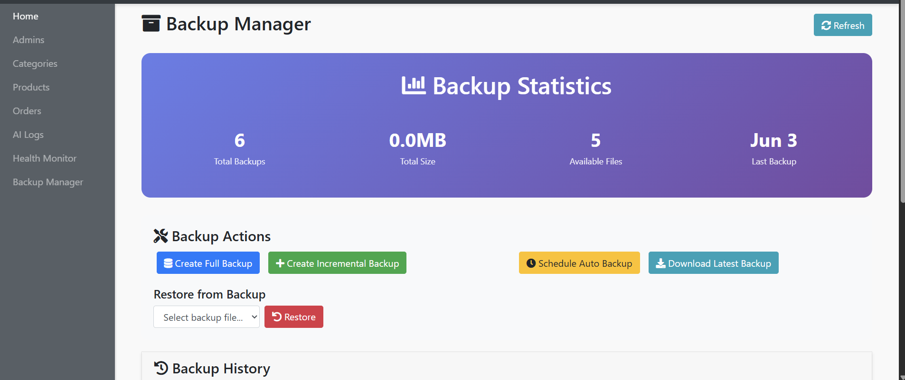
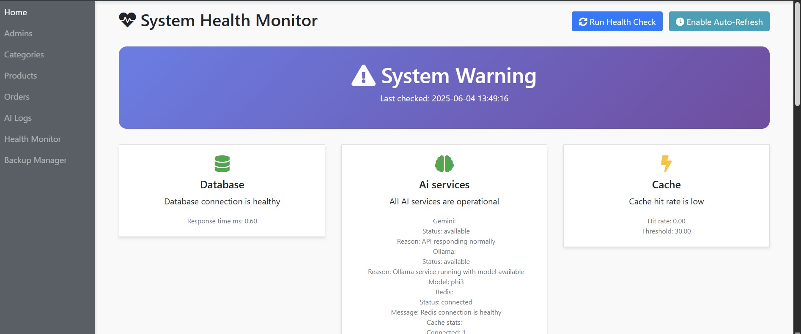
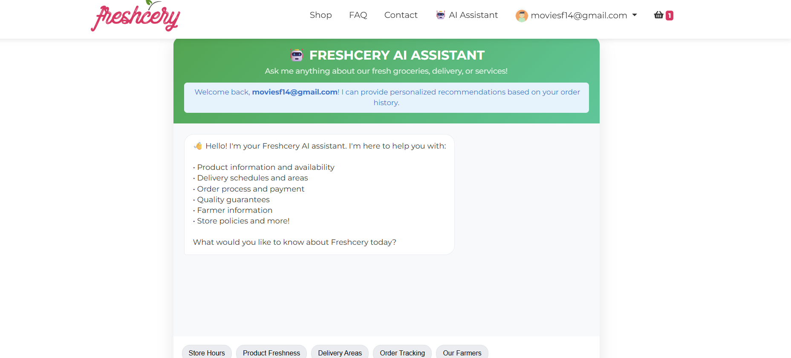
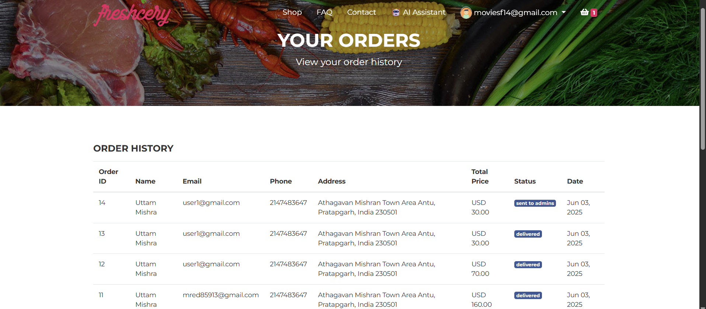

# 🥦 Freshcery - AI-Driven Grocery E-Commerce Platform

**Freshcery** is a full-stack e-commerce platform for online grocery shopping, enhanced with AI-powered customer support. It provides users a seamless shopping experience and gives admins complete control via a secure dashboard.

---

## 🚀 Features

### 🤖 AI-Driven Support System
- **Gemini Pro + Ollama fallback** for 24×7 chatbot support
- **Redis caching** for fast repeated replies
- **MySQL `ai_logs` table** to log and analyze all user queries

### 🛒 E-Commerce Core
- Product listing, cart, checkout, and order tracking
- User registration, login, and profile management
- Admin panel with category & product control
- Transaction log, settings, and dynamic category icons

### 🔒 Security & Architecture
- Built with **PHP 7.4 + MySQL + Redis (planned)**
- **Input sanitization**, **password hashing**, and **IP logging**
- **.env-based config** for API keys & credentials
- Dockerized setup with planned Redis/Ollama container support

---

## 📦 Tech Stack

| Layer            | Tech                                      |
|------------------|-------------------------------------------|
| Frontend         | HTML5, CSS3, JS, Bootstrap                |
| Backend          | PHP 7.4 (modular + includes)              |
| Database         | MySQL (InnoDB)                            |
| AI Integration   | Google Gemini Pro + Ollama (Local LLM)    |
| Caching Layer    | Redis (planned, optional via Docker)      |
| Containerization | Docker with `render.yaml` for deployment  |
| Web Server       | Apache (XAMPP-friendly for local)         |

---

## 📁 Folder Structure

    Freshcery-online-grocery-store/
    ├── admin-panel/        # Admin dashboard and management tools
    ├── assets/             # Images, stylesheets, and scripts
    ├── auth/               # User authentication scripts
    ├── config/             # Database configuration files
    ├── includes/           # Reusable PHP components (e.g., header, footer)
    ├── products/           # Product-related scripts and data
    ├── users/              # User profile and account management
    ├── 404.php             # Custom 404 error page
    ├── about.php           # About us page
    ├── contact.php         # Contact information and form
    ├── faq.php             # Frequently asked questions
    ├── freshcery.sql       # SQL file to set up the database
    ├── index.php           # Homepage
    ├── shop.php            # Main shopping page
    ├── README.md           # Project documentation

---

## 📸 Project Screenshots

| Page/Section           | Screenshot                                   | Description                                |
|------------------------|----------------------------------------------|--------------------------------------------|
| ⚙️ Admin AI             |               | Admin AI dashboard and features             |
| 💾 Admin Backup         |       | Backup management and restore system        |
| 🩺 Admin System Health  |  | System monitoring and health overview        |
| 🤖 AI Assistant         |       | AI-powered assistant interface               |
| 🛒 Cart                 |                        | Shopping cart page                           |
| 📩 Contact              |                  | Contact form page                            |
| ❓ FAQ                  |                          | Frequently asked questions page              |
| 🏠 Homepage             |                | Main landing/homepage                        |
| 🔐 Login                |                      | User login page                             |
| 📦 Orders               |                    | Order management and history page            |
| ⚙️ Setting              |                  | User or system settings page                  |
| 🛍️ Shop                |                        | Product listing and shop interface            |
| 💳 Transactions         |        | Transaction history and payment status page  |

---

## ⚙️ Local Setup (XAMPP / Apache)

cick to view

### 🧰 Prerequisites

    - PHP 7.2+
    - MySQL or compatible DB
    - Apache server (XAMPP/WAMP)

### 🪜 Installation Steps

# Clone the repo

    git clone https://github.com/bhaktofmahakal/Freshcery-online-grocery-store.git

# Place it inside your web server's root (e.g., xampp/htdocs/)

    Open phpMyAdmin
    
    Create a database: freshcery
    

🔐 Config Environment

Edit the file: 

    config/config.php
    
    define('DB_SERVER', 'localhost');
    
    define('DB_USERNAME', 'root');       // or your MySQL user
    
    define('DB_PASSWORD', '');           // your password if any
    
    define('DB_NAME', 'freshcery');

▶️ Run the App

Open in browser:

    http://localhost/Freshcery-online-grocery-store/

🤝 Contributing

Fork this repo

    Create a branch git checkout -b feature/YourFeature
    
    Make changes and commit git commit -m "Added YourFeature"
    
    Push your branch git push origin feature/YourFeature
    
    Submit a Pull Request 🚀

📄 License

    This project is licensed under the MIT License.

📬 Contact

    Maintained by Utsav Mishra

  
  
  
  
  
  

